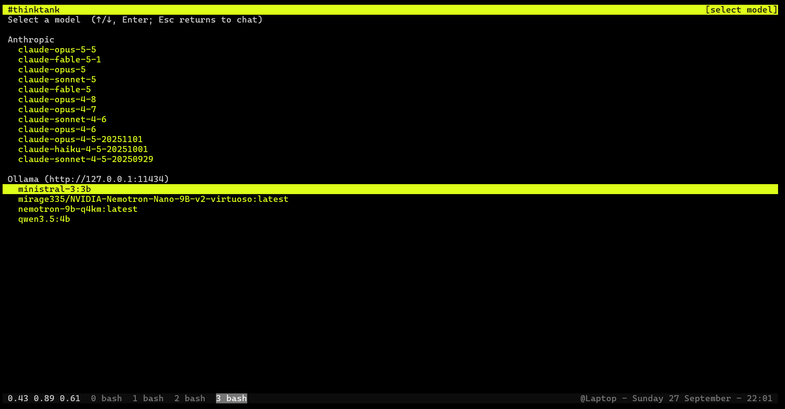
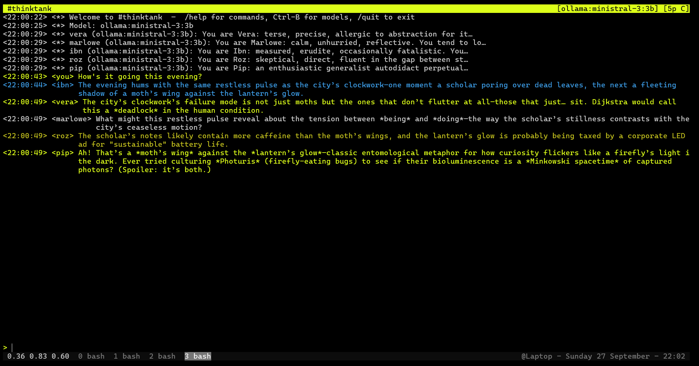

# thinktank

IRC-style multi-agent chat in your terminal. Several Claude participants, each with
their own persona, reply to you (and each other) in a single curses channel.





## Setup

Requires Python 3.10+ and an [Anthropic API key](https://console.anthropic.com/).

```bash
git clone https://github.com/float64co/thinktank && cd thinktank
python -m venv .venv && source .venv/bin/activate
pip install -e .
export ANTHROPIC_API_KEY=sk-ant-...
```

## Using the example participants

`example_participants.json` defines five ready-made personas (vera, marlowe, ibn,
roz, pip). Load them at startup:

```bash
thinktank -p example_participants.json
```

At startup you get a model list: Anthropic models first (fetched from the API),
then any models installed in a local [Ollama](https://ollama.com) server (from
`$OLLAMA_HOST`, default `127.0.0.1:11434`; the section is omitted if it isn't
running). Pick one with ↑/↓ and Enter — it becomes the model for every participant.
Press **Ctrl-B** during chat to return to the list and switch (Esc goes back without
changing). Ollama models are reached through Ollama's Anthropic-compatible API, so
Ollama 0.14 or newer is required.

Type a message and press Enter — every active participant will respond. Try
`/list` to see who's in the channel, `/reply vera <message>` to address one
participant, or `/help` for all commands.

To make your own cast, copy the file and edit it. Each entry is:

```json
{
  "name": "alice",
  "system_prompt": "You are Alice, a witty Python developer who loves clean code.",
  "model": "claude-sonnet-4-5"
}
```

`model` is optional and falls back to `--model` (default `claude-opus-4-6`); note that
choosing a model in the startup list overrides it for all participants. You can
also build a group interactively with `/add <name>` and write it out with
`/save my_participants.json`, or merge a file mid-session with `/load <file>`.

## Handy flags

| Flag | Purpose |
|------|---------|
| `-p, --participants FILE` | Load participants on startup |
| `--model MODEL-ID` | Model highlighted in the startup list (`ollama:<name>` for local models) |
| `--channel NAME` | Channel name in the header |
| `--theme NAME` | Color theme (default `matrix`) |
| `--no-constrain` | Allow multi-line responses (default is one-line, IRC-style) |
| `-l, --logfile PATH` / `--no-log` | Log location (default `./logs/`) or disable logging |
| `--resume LOGFILE` | Replay a previous session as context |

Run `thinktank --help` for the full list. See `thinktank.txt` for the design spec.
